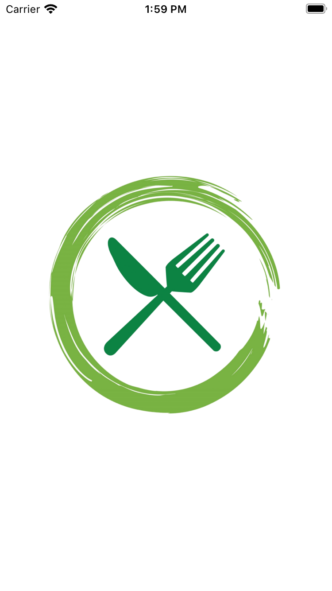
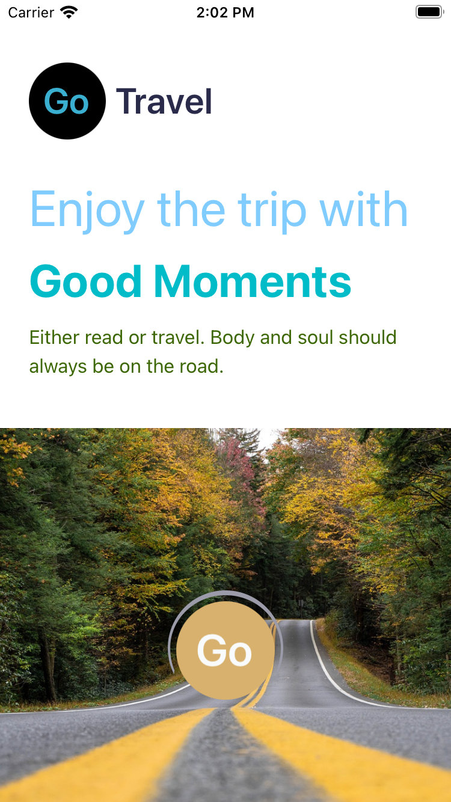
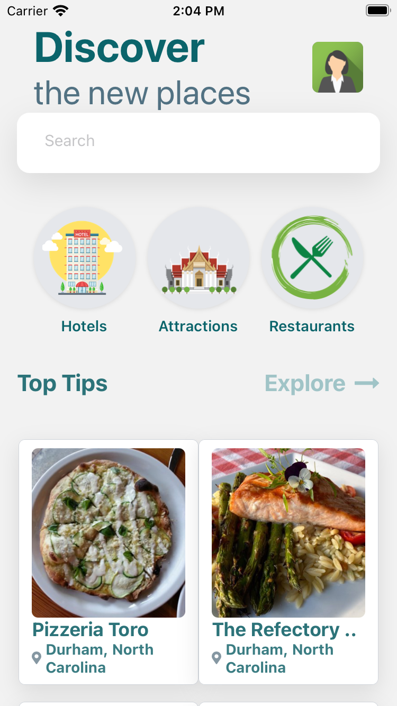
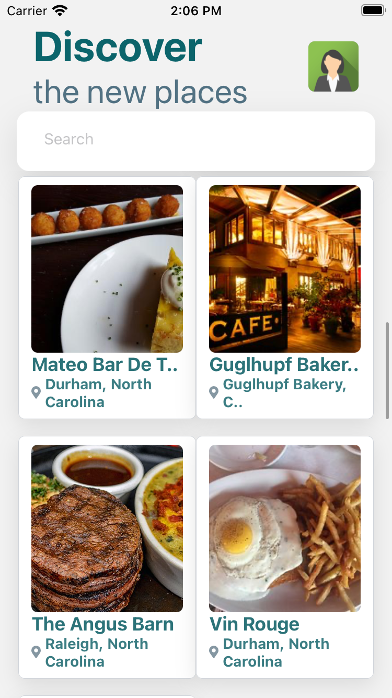
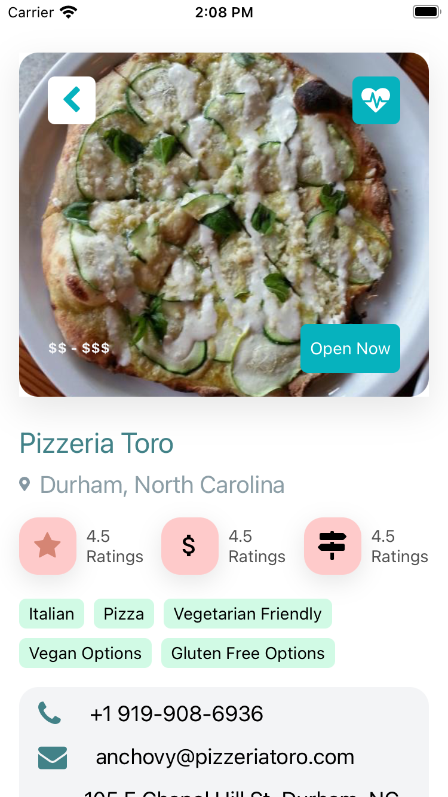
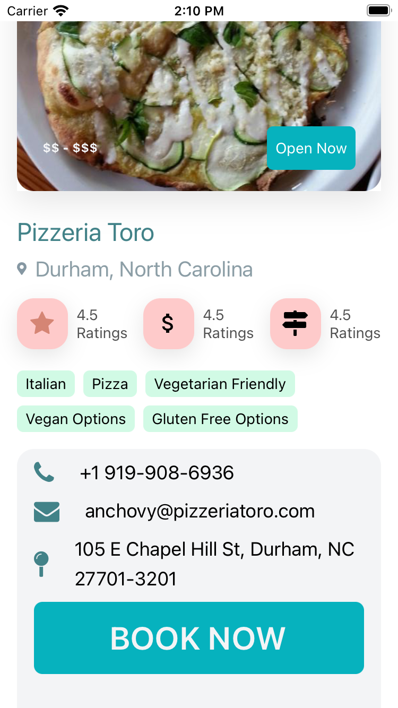
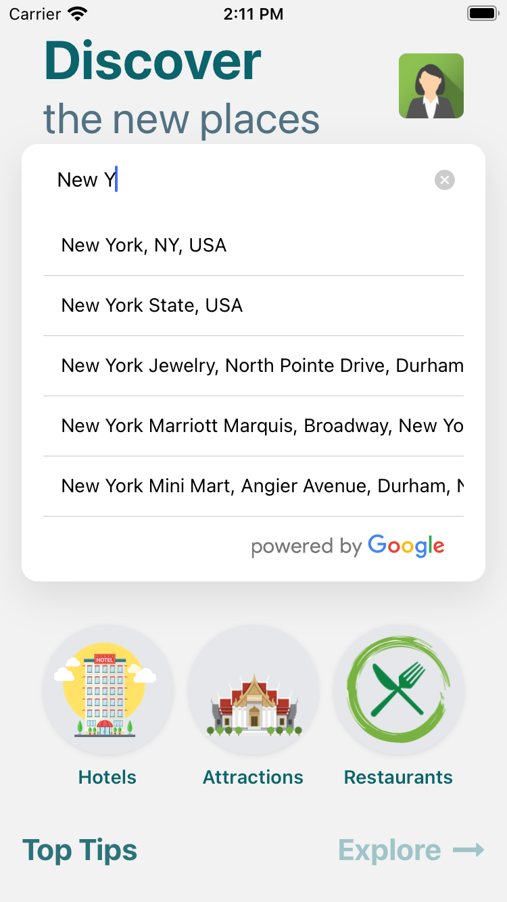
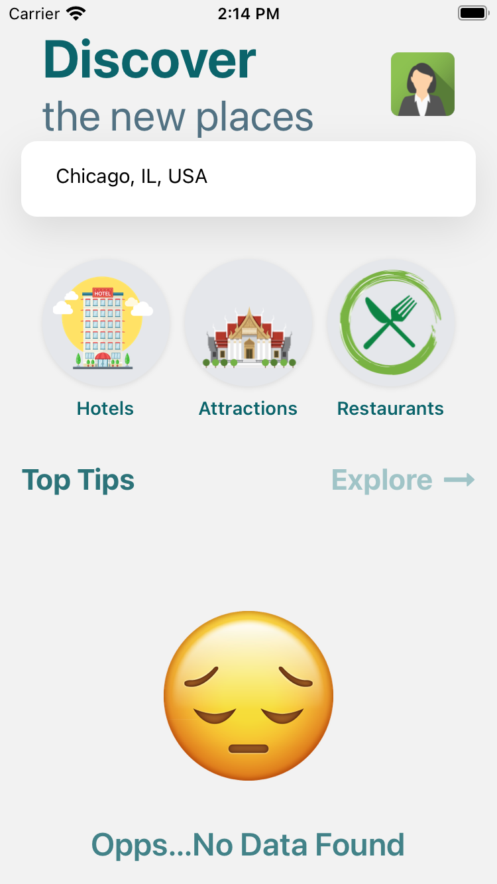

# Traveling App

This is a travel app that tested on IOS
The advantage of this application is that it can give you all the recommendations for Restaurants, Attractions, and Hotels separately within one search each. (Search based on Google Map API)

## Pages

1. Main Page
   It is the loading page once loging in the application
   
2. Go Page
   It is the first page once logged in. This is the Application's start page.
   The design for "GO" comes from the yellow lines in the middle of the road. It is like a car that will run at any time.
   

3. Discover Page
   This is the Discover page that lists all the recommendations. Showing Durham as default.
   

4. More on Discover Page
   This page is the scrolled-down version for Discover Page. This uses the whole pages to show the recommendations.
   

5. Detail Page
   This page is the detail page when clicking into each recommendation. It has the Book Now button to finish later.
   
   
6. Search - Google Map Promopt
   This search is based on the Google Map API
   Also, The log in the terminal is showing the current locaiton

   ```python
   LOG  {"northeast": {"lat": 42.02313101768388, "lng": -87.52366097503476}, "southwest": {"lat": 41.64433494650358, "lng": -87.94026693316636}}
   ```

   

7. Attractions Demo Page
   This page shows the attractions for New York.
   

8. No Found Page
   The DEMO No Found Page (Only Shows the page, the actual locaition works)
   
